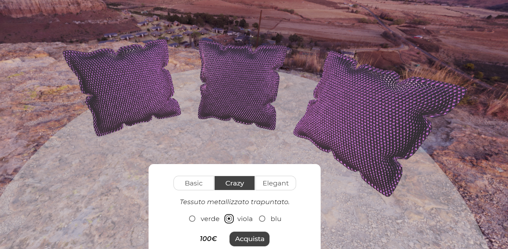

# Progetto di Product Visualization - Vulcano

Il progetto consiste in un configuratore per visualizzare e personalizzare un set di cuscini venduto dall'azienda ACME. L'utente può modificare la tipologia e il colore del tessuto di rivestimento. I tessuti a disposizione sono:
- cotone verde, rosa e azzurro
- tessuto metallizzato verde, viola e blu
- pelle rossa, marrone e blu.

L'utente può osservare da più punti di vista il set di cuscini zoomando e ruotando la telecamera tramite l'uso del mouse.

- overall description: what your project is about and the files it uses.
- results, including images of the scenes created, taken in a way that clearly illustrates that they satisfy the specification.
- brief explanation of the process that you used to make your scene. Include tools, assets, and planning steps.

## File
Il progetto consiste nei seguenti file:
- index.hmtl: pagina web che contiene il configuratore
- css: cartella contenente il file css style.css
- imgs: cartella per il logo ACME e le immagini contenute nel readme e nel journal
- libs: cartella contenente i file javascript necessari al funzionamento del configuratore
    - file per il funzionamento di three.js
    - libreria BufferedGeometryToIndexed.js ([fonte](https://github.com/Fyrestar/THREE.BufferGeometry-toIndexed)) necessaria per indicizzare il modello 3D
- models: cartella contenente il file 3D del cuscino
- textures: cartella contenente le texture dei materiali e la cubemap

## Risultati

Esempi di configurazioni:

### Cotone

### Tessuto metallizzato trapuntato

### Pelle

## Hints

- Try to work out a basic project which satisfies all requirements well before the deadline and as soon as possible: you will then use the remaining time to refine, improve and polish.
- If you are stuck for too much time on a problem, ask for help, preferably in the forum.
- the process is as important as the result. Use this project to learn a workflow, and how to use tools effectively. Experiment, and try to come up with efficient, elegant, and well commented code.
- commit often in your git repository and with meaningful comments.
- do not choose too complex products with many materials. 3-4 materials are enough.

## Goals

The well-known ACME company has asked you to build a product **Web visualizer / configurator** for its new e-commerce site. Before giving you the job, ACME wants to evaluate how faithfully you can visualize and configure products.  ACME sells everything, so you can choose whatever kind of product you want for the demonstration.

Your goal is to build a Web application (a HTML page) that:

- visualizes a product in 3D using three.js, using PBR equations and materials;
- allows the user to inspect the product (e.g. by orbiting the camera around it), and change some material on it by choosing from a few alternatives.

Try to make it look like a simple, but real portion of an e-commerce site, not a three.js example: choose carefully colors, fonts, images, and icons, also taking inspiration from real web sites. Before starting, search the web for existing 3D configurators. Note down what you like and don't like, and try to produce a result as professional as possible.

## Steps (read CAREFULLY)

1. Prepare, and add to the repository, a journal.md file for logging your progress and choices.

2. Choose a product for which: (i) you can easily build a 3D model, or (ii) you can download a 3D model which you have the right to use in non-commercial applications. The model should not be too complex (not more than 100k vertices) and in some format that three.js can read. [Three.js examples](https://threejs.org/examples/) provide a list of loaders for different formats: beware that not all of them work perfectly, and you might have to try with different formats. Preferably, use GLTF, but any other format is ok.

3. Design the lighting for the product. Products in web sites and catalogues are photographed using strategically placed lights that enhance details and shape. For example, [searching google images for product photography lighting](http://www.google.com/images?q=product+photography+lighting) will show you a number of real-world lighting setups that are used for products. In your lighting setup, you can use whatever you want, from punctual lights, to environment map, or light maps, or any combination of them, but you *must include* an environment map.

4. Design the PBR materials for the product. You can use PRB textures found anywhere, or produce them, e.g. with Substance Designer or B2M. If you use textures authored by someone else, just make sure you have the rights for using them in our context (non-commercial application). At least one of the materials must have 2-3 alternatives (e.g. different colors, or materials).

5. Include tone mapping and, if needed, post-processing/color correction.

6. Build the application that renders the chosen 3D model, with the designed lighting setup and materials, and an user interface for selecting the material between the alternatives. You must use shaders written by you, e.g. by extending the shaders we saw in the classroom. Your report needs to describe the kind of BRDF / lights you have implemented.

7. If possible, try to take into account implicit requirements as well. For example, you cannot use textures with file sizes of dozens of megabytes for a Web site; and also, your page should render at least at 30 fps on average smartphones. You will get bonus points for a result that could be deployed to a Web site with few or no modifications.

8. (optional) include any technique that was not explained in the classroom, e.g. some special shader or post-processing technique. This will award you extra points in the evaluation.

9. Write a concise report by overwriting this file.

You are required to document your project in two ways:

- maintain a journal (in a file called journal.md) describing key design decisions, changes, bug symptoms and solutions, including screenshots.
- create a report (by overwriting this file).

## Constraints

 mention any source of inspiration in your journal and final report.

## Credits

[Modello del cuscino](https://www.turbosquid.com/3d-models/cushion-sofa-pillow-3d-model-1222929) (Turbosquid.com)
[Texture cotone](https://www.sharetextures.com/textures/fabric/light-green-fabric-52/) (sharetextures.com)
[Texture tessuto metallizzato](https://www.texturecan.com/details/144/) (texturecan.com)
[Texture pelle](https://www.sharetextures.com/textures/fabric/leather-3/) (sharetextures.com)
Libreria [BufferGeometryToIndexed.js](https://github.com/Fyrestar/THREE.BufferGeometry-toIndexed)
