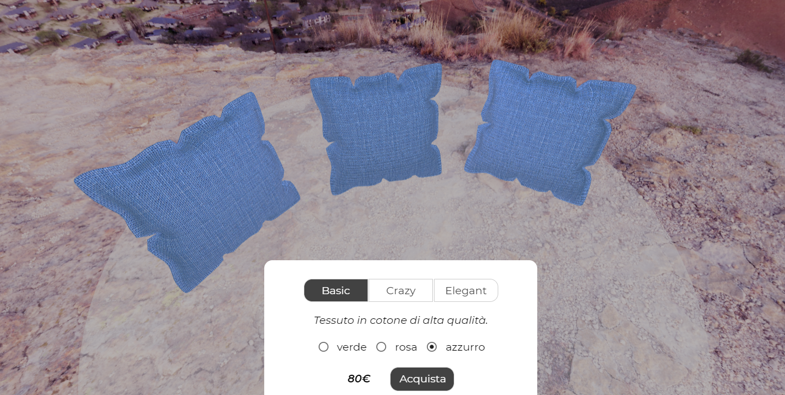
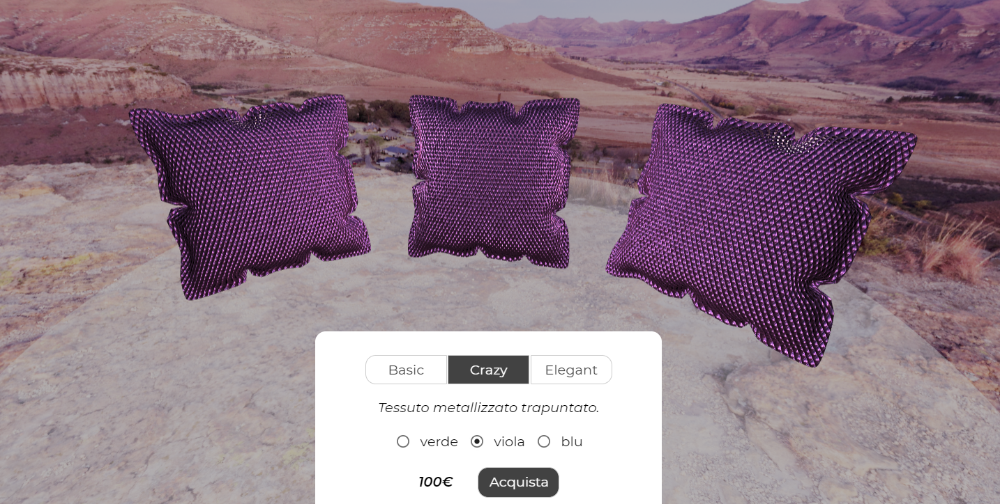
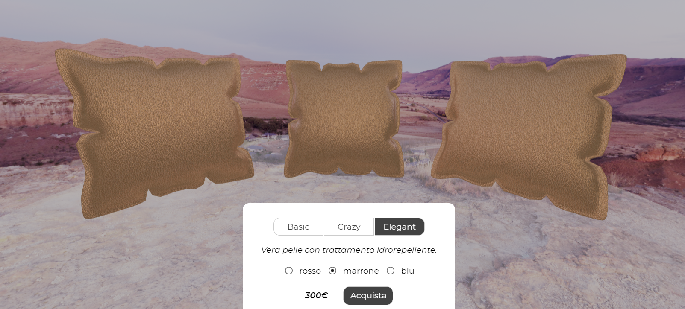

# Progetto di Product Visualization - Vulcano

Il progetto consiste in un configuratore per visualizzare e personalizzare il set di cuscini "Sunset" venduto dall'azienda ACME. L'utente può modificare la tipologia e il colore del tessuto di rivestimento. I tessuti a disposizione sono:
- cotone verde, rosa e azzurro;
- tessuto metallizzato verde, viola e blu;
- pelle rossa, marrone e blu.

L'utente può osservare da più punti di vista il set di cuscini zoomando e ruotando la telecamera tramite l'uso del mouse. Per coerenza col nome del set di cuscini, i modelli appaiono inseriti in un ambiente al tramonto.

## File
Il progetto consiste nei seguenti file:
- **index.html**: pagina web che contiene il configuratore
- **css**: cartella contenente il file style.css
- **imgs**: cartella contenente il logo ACME e gli screenshot contenuti nel readme e nel journal
- **libs**: cartella contenente i file javascript necessari al funzionamento del configuratore
    - file per il funzionamento di three.js
    - funzione [toIndexed()](https://github.com/Fyrestar/THREE.BufferGeometry-toIndexed) necessaria per rendere indexed la geometria del modello
- **models**: cartella contenente il modello 3D del cuscino
- **textures**: cartella contenente le texture dei materiali e la cubemap

## Risultati

Esempi di configurazioni:

### Cotone

### Tessuto metallizzato trapuntato

### Pelle

## Implementazione

### Modello
Sono state posizionate tre istanze dello stesso modello OBJ su un piano semitrasparente che non vuole essere un vero e proprio piano di appoggio (non presenta infatti le ombre dei cuscini) ma solo un elemento grafico decorativo. 

Per rendere possibile a three.js calcolare le tangenti dell'oggetto da passare al vertex shader è stato necessario usare la funzione [toIndexed()](https://github.com/Fyrestar/THREE.BufferGeometry-toIndexed) trovata online.

### Shader
Il progetto prevede un vertex shader e tre fragment shader (mai eseguiti contemporaneamente). A seconda del materiale selezionato dall'utente, il vertex shader comunica con un fragment shader diverso:
- Un **fragment shader lambertiano** per simulare il cotone: fa uso di diffuse map, normal map, roughness map e ao map.
- Un **microfacet fragment shader** per simulare il tessuto metallizzato: fa uso di normal map e roughness map.
- Un **fragment shader che combina BRDF lambertiana e BRDF speculare** per simulare la pelle: fa uso di diffuse map, specular map, normal map, roughness map e ao map.

Tutti e tre gli shader considerano la luce proveniente da tre point lights (posizionate in modo tale da illuminare sia fronte sia retro dei modelli) e considerano nel calcolo dell'illuminazione anche i dati di una environment map: si tratta di una latlong map scaricata dal sito [HdriHaven](https://hdrihaven.com) e poi convertita in cubemap tramite il tool online [HDRI to Cubemap](https://matheowis.github.io/HDRI-to-CubeMap/).

### Tone mapping
Si è scelto di applicare alla scena un tone mapping di tipo ACES Filmic.

### Textures
Le texture usate sono state scaricate dai siti [ShareTextures](www.sharetextures.com) e [TextureCan](https://www.texturecan.com). Per creare le variazioni di colore dei tessuti cotone e pelle si è modificata la diffuse map tramite Photoshop; mentre le variazioni del colore del tessuto metallizzato sono dovute alla modifica del vettore che modella la componente speculare della riflessione.

### GUI
La presenza di un menù web nella parte superiore della schermata simula l'inserimento del configuratore all'interno del sito web dell'azienda ACME. Nel definire l'interfaccia per la modifica dei materiali, posta nella parte centrale inferiore dello schermo, si è cercato di immaginare di rivolgersi a un pubblico di potenziali acquirenti di un sito che vende oggetti di design. È all'interno di quest'ottica che si colloca la scelta dei nomi creativi dei materiali ("Basic", "Crazy", "Elegant") e del set di cuscini ("Sunset").

## Credits

[Modello del cuscino](https://www.turbosquid.com/3d-models/cushion-sofa-pillow-3d-model-1222929)  
[Texture cotone](https://www.sharetextures.com/textures/fabric/light-green-fabric-52/)  
[Texture tessuto metallizzato](https://www.texturecan.com/details/144/)  
[Texture pelle](https://www.sharetextures.com/textures/fabric/leather-3/)   
[Cubemap](https://hdrihaven.com/hdri/?c=outdoor&h=kiara_1_dawn)  
Funzione [BufferGeometryToIndexed.js](https://github.com/Fyrestar/THREE.BufferGeometry-toIndexed)
