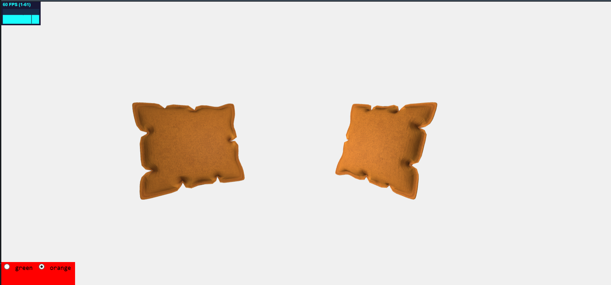
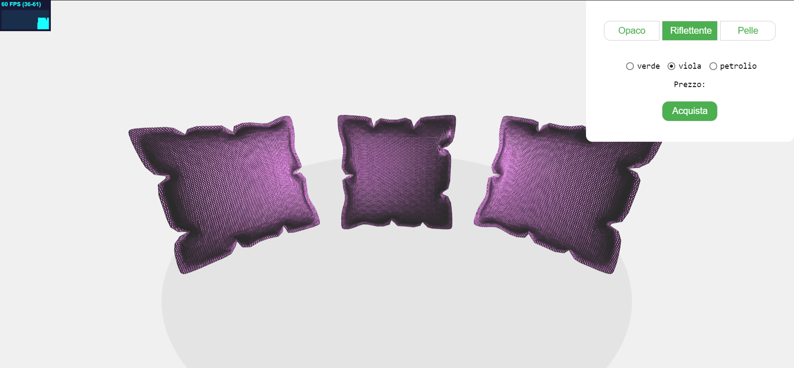
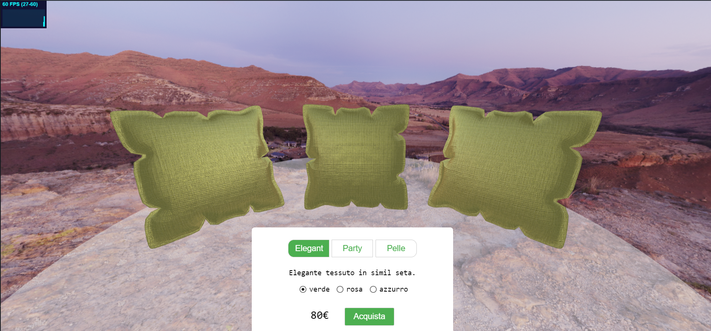
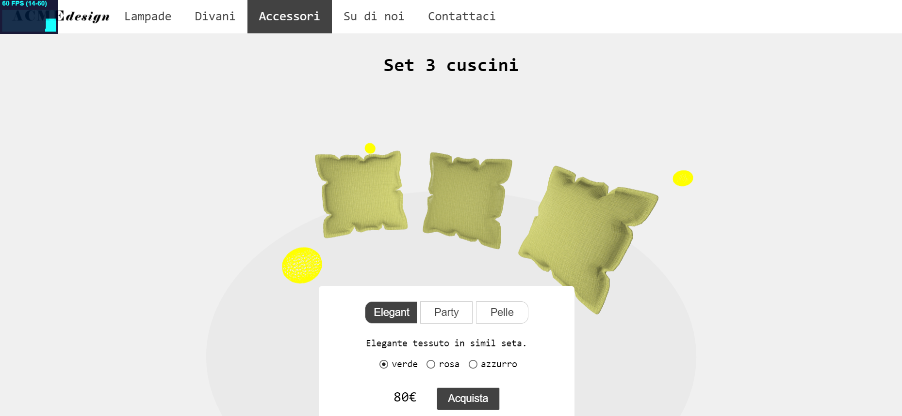
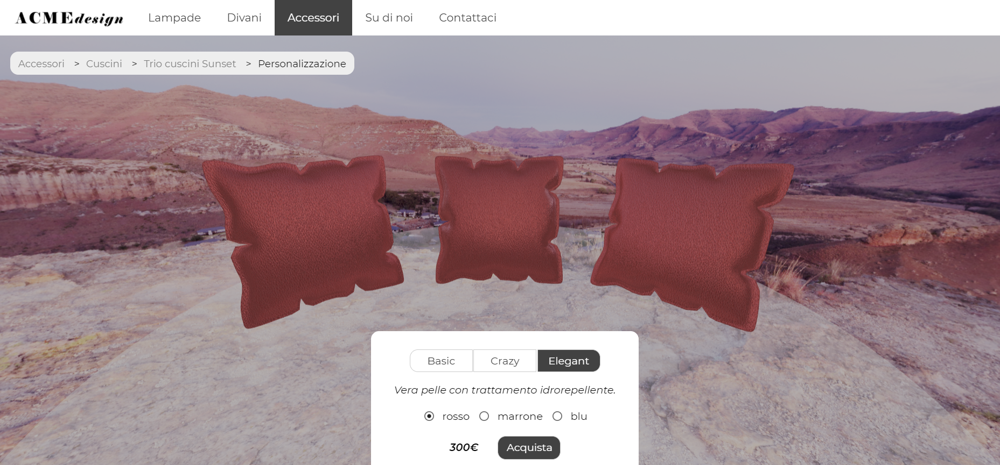

# 2 luglio
- Ricerca online di modelli 3D e di esempi di configuratori di prodotto. 
- Scelta del modello del cuscino e ricerca di ispirazione per i materiali. Prime idee: creare tre materiali, di cui uno che simuli la seta.

# 3 luglio
- Creazione della scena (con orbit controls e stats) e inserimento di due istanze del modello. 
- Inizio scrittura di uno shader di prova, usando una point light e alcune texture di cui è dotato il modello 3D. 
- Progettazione e inizio creazione della GUI per la selezione dei materiali.

# 5 luglio
- Prova di altre texture e decisione che il primo materiale simulerà la seta: scrittura shader.
- Idea: il secondo materiale simulerà un tessuto metallizzato. Ricerca di foto di riferimento e texture.
- Continuo dello sviluppo della GUI.

# 6 luglio
- Scrittura fragment shader per il materiale metallizzato usando inizialmente una combinazione di BRDF diffusiva e speculare e provando varie texture map. Decisione di usare la sola BRDF speculare e di variare il colore del materiale modificando un vettore che rappresenta il parametro cspec.
- Decisione di creare come terzo materiale la pelle. Ricerca di texture ma non ancora implementato lo shader.
- Aggiunta di una terza istanza del modello e continuazione dell'implementazione della GUI.
- Aggiunta di un piano semistrasparente e scelta di non renderizzarvi sopra ombre. 

# 7 luglio
- Aggiunta alla scena una cubemap usata come environment map negli shader. 

- Prova di vari tipi di tone mapping. 
- Aggiunto menù del sito con logotipo creato in Photoshop.

# 8 luglio
- Decisione di modificare il fragment shader del primo materiale in modo che simuli il cotone e non la seta: usata BRDF lambertiana.
- Studio delle luci disabilitando la cubemap e utilizzando delle geometrie a sfera come aiuto: scelta di aggiungere altre due point light e di posizionarle sia davanti sia dietro agli oggetti. 

- Rifinitura dell'aspetto dell'interfaccia tramite aggiunta di finti breadcrumbs ed eliminazione degli stats.

# 9 luglio
- Completamento dei fragment shader per cotone e tessuto metallizato con l'aggiunta delle normal map. Malfunzionamenti e difficoltà a individuarne la causa, poi scoperta che three.js non riesce a creare tangenti per una geometria non indexed. Problema risolto grazie a una funzione trovata online che rende indexed una geometria che non lo è.

# 10 luglio
- Scrittura del fragment shader per il materiale pelle: usata BRDF con termine diffusivo e speculare.
- Prove di altre cubemap ma scelta di tenere quella corrente. Idea: nominare il set di cuscini "Sunset" per creare un legame fra prootto e ambientazione. 
- Rifinitura GUI.
- Pulizia del codice ed eliminazione dei file non utilizzati.
- Aggiunte limitazioni per gli orbit controls: impedito il pan, regolamentato lo zoom.

# 11 luglio
- Modifica degli orbit controls in modo da limitare il movimento verticale della telecamera.
- Scrittura del file readme e del file journal (precedentemente tenuto solo in locale in formato txt).

